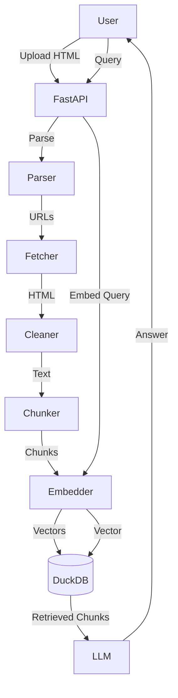

# System Architecture

## Overview

Bookmark RAG Tool is a local-first application designed to ingest browser bookmarks and provide a chat interface using RAG (Retrieval-Augmented Generation).

## Components

### 1. Frontend (`frontend/`)
- **Framework**: React + Vite + TypeScript.
- **Styling**: Tailwind CSS.
- **Responsibilities**:
  - File upload UI (POST `/api/upload`).
  - Real-time progress display (SSE `/api/ingest-status`).
  - Chat interface (POST `/api/query`).
  - Rendering answers and citations.

### 2. Backend (`app/`)
- **Framework**: FastAPI (Python).
- **Structure**:
  - `app/main.py`: Entry point, CORS, static mounting.
  - `app/routes/`: API endpoints (`ingest.py`, `query.py`).
  - `app/ingestion/`: Pipeline logic.
    - `parser.py`: Netscape HTML parsing (BeautifulSoup).
    - `fetcher.py`: Async HTTP fetching (httpx).
    - `cleaner.py`: Content extraction (readability-lxml).
    - `chunker.py`: Text chunking (nltk).
  - `app/storage/`: Data persistence.
    - `duckdb_store.py`: DuckDB wrapper for bookmarks and vectors.
  - `app/embeddings/`: Embedding generation.
    - `local_embedder.py`: SentenceTransformers (local).
    - `openai_embedder.py`: OpenAI API (cloud option).
  - `app/rag/`: RAG Logic.
    - `retriever.py`: Vector search + filters.
    - `llm/`: LLM clients (Ollama, etc.).
    - `engine.py`: Orchestrator (Augment + Generate).

### 3. Data Storage
- **Database**: DuckDB (`bookmarks.duckdb`).
- **Schema**:
  - `bookmarks`: URL, title, folder, date, status.
  - `chunks`: Chunk text, embedding vector (384d), metadata references.

### 4. RAG Pipeline
1. **Ingestion**:
   - Parse HTML -> Filter duplicates -> Fetch URL -> Clean HTML -> Chunk Text -> Embed -> Store in DuckDB.
2. **Query**:
   - Embed Query -> Vector Search (DuckDB) -> Filter Results -> Construct Prompt -> LLM Generation -> Stream Response.

## Data Flow

